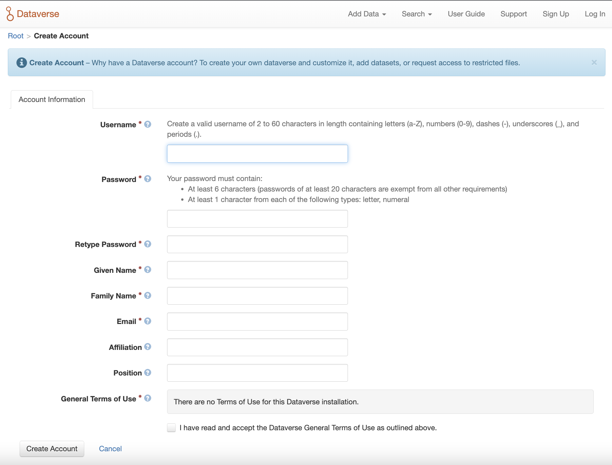
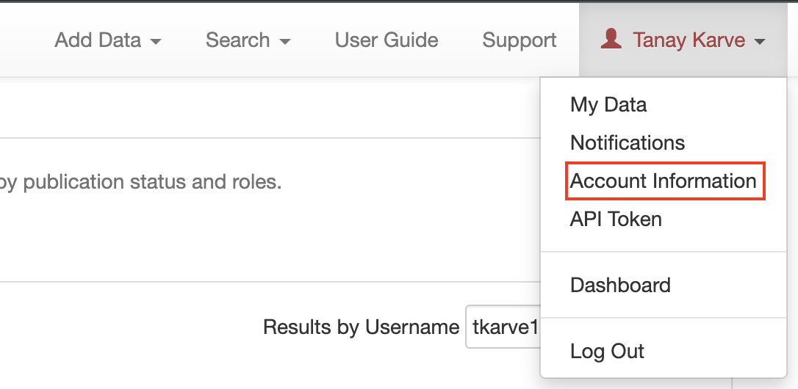
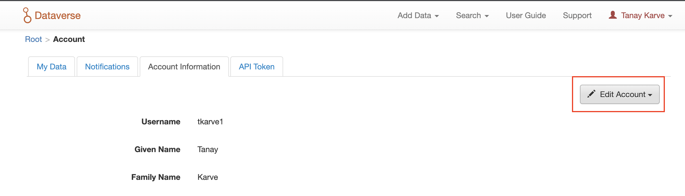

## Account Creation
### Sign Up

To create a Dataverse account with the Username/Email log in option, use the [Sign Up](https://dataverse.dsmlp.ucsd.edu/dataverseuser.xhtml?editMode=CREATE) page. Fill out the fields, and then click the ‘Create Account’ button.

 _Please note that the Username field does not support email addresses but will allow the following characters: a-Z, 0-9, _ (underscores), - (hyphens), and . (periods)._

### Edit Account
1. To edit your account after you have logged in, click on your account name in the header on the right hand side and click on Account Information.

2. On the top right of your account page, click on the “Edit Account” button and from there you can select to edit either your Account Information or your Account Password.

3. Select “Save Changes” when you are done.
