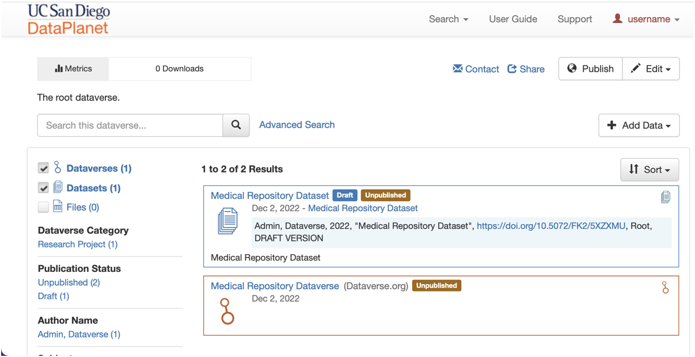

# DataPlanet
{: .fs-9 }

A collective resource to enable and spur easily reproducible,
shareable, and searchable data-intensive research at UC San Diego 

<!-- {: .fs-6 .fw-300 } -->

[Get started now](http://dataverse.dsmlp.ucsd.edu){: .btn .btn-primary .fs-5 .mb-4 .mb-md-0 .mr-2 } [Watch Demos]({{ site.baseurl }}){: .btn .fs-5 .mb-4 .mb-md-0 } [View it on GitHub](https://github.com/ADALabUCSD/DataPlanet){: .btn .fs-5 .mb-4 .mb-md-0 }

---

## About 
### Data Management: Then vs Now.

Then |  Now
:-------------------------:|:-------------------------:
  |  

- Enjoy full control over your data. Receive web visibility, academic credit, and increased citation counts. A personal Dataverse collection is easy to set up, allows you to display your data on your personal website, can be branded uniquely as your research program, makes your data more discoverable to the research community, and satisfies data management plans. 
- Seamlessly manage the submission, review, and publication of data associated with published articles. Establish an unbreakable link between articles in your journal and associated data. Participate in the open data movement by using a Dataverse collection as part of your journal data policy or list of repository recommendations.
- Establish a research data management solution for your community. Federate with a growing list of Dataverse repositories worldwide for increased discoverability of your community’s data. Participate in the drive to set norms for sharing, preserving, citing, exploring, and analyzing research data. 

### Two wings of DataPlanet:

Secure-private sharing uising Dataverse           |  "Data Nuggets" for Public Sharing
:-------------------------:|:-------------------------:
For both in-progress and published research. | Resource for educators and learners inside/outside UCSD.
Files can stay at UCSD. | For completed / published work.
 Levels of access control. | Files on public cloud.

### What exactly is Dataverse?

## Acknowledgements

This work was supported by from HDSI. It was hosted on SDSC. 

## License

DataPlanet is distributed under [Apache License v2.0](https://github.com/ADALabUCSD/DataPlanet/blob/master/LICENSE).

<!-- ### Contributing

When contributing to this repository, please first discuss the change you wish to make via issue,
email, or any other method with the owners of this repository before making a change. Read more about becoming a contributor in [our GitHub repo](https://github.com/just-the-docs/just-the-docs#contributing).

#### Thank you to the contributors of Just the Docs!

<ul class="list-style-none">

  <li class="d-inline-block mr-1">
     
  </li>

</ul>

### Code of Conduct

Just the Docs is committed to fostering a welcoming community.

[View our Code of Conduct](https://github.com/just-the-docs/just-the-docs/tree/main/CODE_OF_CONDUCT.md) on our GitHub repository. -->
